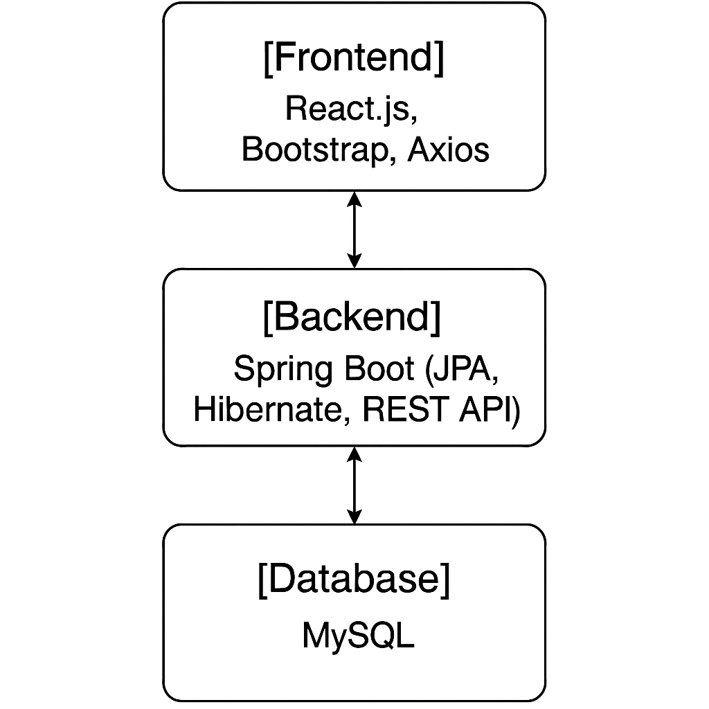

# Todo Management App ✅📋


## Welcome to Todo Management System 🎉
The **Todo Management System** is a lightweight yet powerful full-stack application designed to keep your tasks organized, efficient, and easily manageable. With a modern **React.js** frontend and a robust **Spring Boot** backend, this app delivers simplicity, speed, and scalability for everyday productivity.

---

## 📌 Table of Contents
- [Overview](#overview)
- [Key Features](#key-features)
- [Technical Stack](#technical-stack)
- [System Architecture](#system-architecture)
- [Installation Guide](#installation-guide)
- [Usage Guide](#usage-guide)
- [API Documentation](#api-documentation)
- [Project Structure](#project-structure)
- [Development Guidelines](#development-guidelines)
- [License](#license)
- [Roadmap](#roadmap)
- [Contributors](#contributors)
- [Support & Contact](#support--contact)

---

## 🌟 Overview
The *Todo Management App* is crafted to help individuals manage tasks efficiently using a responsive and scalable tech stack.

- *🎯 Purpose*: Simple, intuitive task management system
- *👥 Target Audience*: Students, devs, productivity enthusiasts
- *🔖 Version*: `1.0.0`

---

## 🔥 Key Features
✅ *Create Tasks*: Quickly add todos  
✅ *Update Tasks*: Edit and mark complete/incomplete  
✅ *Delete Tasks*: Clean up completed or irrelevant items  
✅ *Responsive UI*: Mobile-ready experience  
✅ *RESTful API*: Structured backend integration  
✅ *Validation*: Prevent empty or invalid submissions  
✅ *Component-Based UI*: Easy to scale and maintain  
✅ *Error Handling*: Smooth user feedback and logs  
✅ *Minimalistic Design*: Focused on usability and clarity  

---

## 🏗️ Technical Stack
### *Frontend* (React.js)
- *Framework*: React (with Vite)
- *Styling*: CSS / Bootstrap (based on your setup)
- *State Management*: React Hooks
- *HTTP Requests*: Axios
- *Routing*: React Router

### *Backend* (Spring Boot)
- *Framework*: Spring Boot `3.4.4`
- *Database*: MySQL
- *ORM*: Spring Data JPA + Hibernate
- *Security*: Basic Auth / Expandable
- *Build Tool*: Maven

### *Dev Tools*
- *Version Control*: Git + GitHub
- *IDE*: IntelliJ IDEA / VS Code
- *Testing*: JUnit, Postman

---

## 🏛 System Architecture
```plaintext
[Frontend] -- React.js, Axios
   |
   v
[Backend] -- Spring Boot (REST APIs)
   |
   v
[Database] -- MySQL
```



---

## ⚡ Installation Guide
### Prerequisites ✅
- **Node.js & npm** (`18+`): [Download](https://nodejs.org/)
- **JDK 21+**: [Download](https://www.oracle.com/java/technologies/javase/jdk21-archive-downloads.html)
- **MySQL 8+**: [Download](https://www.mysql.com/)
- **Git**: [Download](https://git-scm.com/)

### 🚀 Quick Start

#### 1️⃣ Clone the Repository
```bash
git clone https://github.com/ezekielemana/todo-app.git
cd todo-app
```

#### 2️⃣ Backend Setup
```bash
cd todo-backend
./mvnw spring-boot:run
```

#### 3️⃣ Frontend Setup
```bash
cd ../todo-frontend
npm install
npm run dev
```

#### 4️⃣ View in Browser
Go to: `http://localhost:5173`

---

## 🛠 Usage Guide
1. **Add** a new task using the input field.
2. **Check off** tasks as you complete them.
3. **Update or delete** tasks any time.
4. Repeat daily to stay productive 💪

---

## 📑 API Documentation
- `GET /todos` - Fetch all todos
- `GET /todos/{id}` - Fetch by Id's todo  
- `POST /todos` - Add a new todo  
- `PUT /todos/{id}` - Edit / Update a todo  
- `DELETE /todos/{id}` - Delete a todo
- `GET /todos/filter` - Filter todo by Completed
- `GET /todos/search` - Search todo by it's Title   

Explore more at `/api/docs` (Swagger UI if configured)

---

## 📂 Project Structure
```plaintext
todo-app/
├── todo-frontend/          # React-based frontend
│   ├── src/
│   │   ├── components/    # Reusable UI components
│   │   │
│   │   ├── App.jsx       # Main application component
│   │   ├── index.js      # Entry point
│   └── package.json      # Frontend dependencies
├── todo-backend/           # Spring Boot backend
│   ├── src/
│   │   ├── main/
│   │   │   ├── java/
│   │   │   │   └── com/todoapp/todo_backend/
│   │   │   │       ├── controller/    # REST controllers
│   │   │   │       ├── dto/          # Data transfer objects
│   │   │   │       ├── entity/       # Database entities
│   │   │   │       ├── exception/    # Custom exceptions
│   │   │   │       ├── mapper/       # Object mapping utilities
│   │   │   │       ├── repository/   # JPA repositories
│   │   │   │       ├── service/      # Business logic
│   │   │   └── resources/            # Configuration files
│   │   └── test/                     # Unit tests
│   └── pom.xml                       # Maven build file
├── README.md
└── .gitignore
```

---

## 🔧 Development Guidelines
- Stick to **clean, modular code**
- Use **meaningful commit messages**
- Prefer **env configs** over hardcoding
- Keep components **reusable & simple**

---

## 📝 License
This project is **NOT licensed** under any organization — feel free to use it for learning or personal use. 🚫📜

---

## 🚀 Roadmap
- [ ] Add user login & registration (JWT Auth)  
- [ ] Role-based access control  
- [ ] UI upgrade with Material UI or Tailwind  
- [ ] Add support for deadlines and reminders  

---

## 🤝 Contributors
🔹 [Ezekiel Lemana](https://github.com/ezekiellemana) – Project Lead, Backend & Frontend Developer

---

## 📞 Support & Contact
Got questions or suggestions?

📧 **Email**: ezekielaugustino@gmail.com  
📸 **Instagram**: [@Enzo_leman10](https://www.instagram.com/enzo_leman10/)  
🐛 **Bug Reports**: [GitHub Issues](https://github.com/ezekiellemana/ems-project/issues)

---

### 🚀 Your feedback makes me better! Keep building 🔥
```
